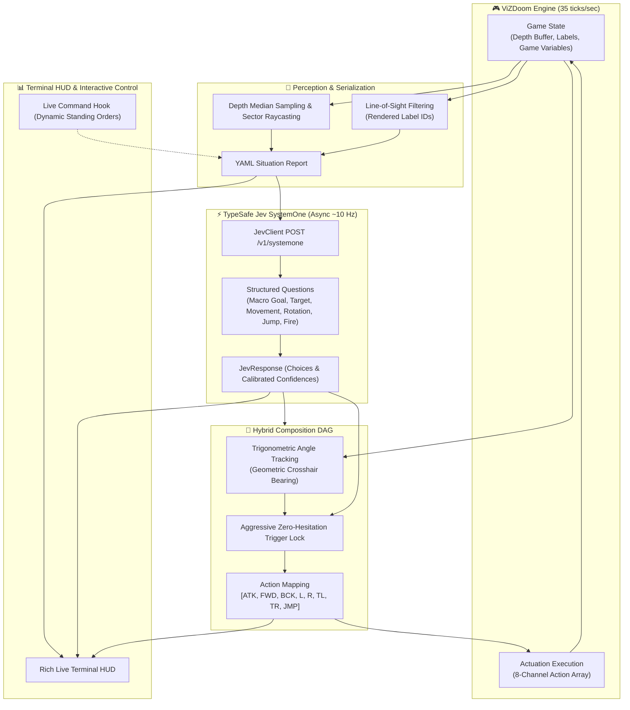

# ⚡ DOOM-JEV: Autonomous ViZDoom Agent

> **Real-time autonomous Doom agent powered by TypeSafe's Jev SystemOne fast-inference model, featuring a decoupled asynchronous control loop, geometric raycasting, and an interactive Rich terminal HUD.**

---

## 📖 Overview

**DOOM-JEV** pairs the classic id Software game engine (via [ViZDoom](https://vizdoom.farama.org/)) with **TypeSafe Jev SystemOne**, a low-latency model designed for rapid structured perception and real-time decision-making. 

Instead of treating the game as a slow turn-based environment or suffering from network-induced stutter, **DOOM-JEV** decouples the engine tick rate from the network inference rate:
- **Simulation Loop:** Runs at Doom's native **35 ticks/sec** with smooth rendering and continuous physics.
- **Inference Loop:** Runs asynchronously at **~10 Hz**, querying structured decision trees from Jev SystemOne.
- **Carry-Hold Actuation:** Between inference batches, the agent smoothly replays and adjusts its action space using real-time geometric tracking, ensuring 0 dropped frames.

---

## 🏛️ System Architecture



---

## ✨ Key Features

- **Decoupled Asynchronous Loop:** The ViZDoom engine ticks continuously while API requests run non-blocking in the background. If a network roundtrip takes 80–120ms, the player never freezes.
- **Geometric Raycasting & Obstacle Detection:** Combines ViZDoom's 3D depth buffer median analysis with 2D sector line-segment ray intersection to detect walls ahead, left, and right.
- **Line-of-Sight Target Filtering:** Uses the rasterizer's rendered label buffer so the agent only targets hostiles that are actually visible on screen, preventing the model from hallucinating or shooting through solid walls.
- **Hybrid DAG Actuation:** 
  - **Macro Guidance:** Jev determines high-level strategy (*engage, explore, flee, collect weapon*).
  - **Micro Geometry:** Exact relative bearing trigonometric calculations steer the crosshair directly onto enemies with zero delay.
  - **Zero-Hesitation Trigger Lock:** Fires immediately when an enemy is within crosshair tolerance ($\le 15^\circ$) or when firing confidence exceeds threshold.
- **Interactive Rich Terminal HUD:** Displays real-time situational awareness:
  - Situation report (health, armor, weapons, ammo, visible threats, obstacles).
  - Decision DAG with color-coded confidence levels.
  - 8-channel actuation indicators.
  - Live roundtrip API latency (ms).
- **Dynamic Standing Orders:** Update the agent's behavior live from the terminal prompt without restarting the simulation.

---

## 📂 Project Structure

```text
doom-jev/
├── agent/
│   ├── __init__.py
│   ├── actuator.py          # Formats action tuples to 8-channel ViZDoom button inputs
│   ├── composition_dag.py   # Hybrid DAG merging Jev choices with ground-truth geometry
│   ├── jev_client.py        # Async HTTP client for TypeSafe Jev SystemOne API
│   └── state_serializer.py  # Raycasting, LOS filtering & YAML situation reporting
├── config/
│   └── custom_scenario.cfg  # ViZDoom scenario configuration (buttons & game variables)
├── logs/                    # Rotating API logs (git-ignored)
├── ui/
│   └── terminal_hud.py      # Rich Live dashboard layout & confidence rendering
├── .env.example             # Example environment file template
├── .gitignore               # Ignores .env, logs, venvs, cache, and runtime configs
├── main.py                  # Main async event loop & game orchestrator
└── requirements.txt         # Project dependencies
```

---

## 🚀 Quick Start

### 1. Prerequisites

- Python 3.10+ (tested on Python 3.14)
- ViZDoom dependencies (Linux users may need standard SDL2 / Boost libraries if compiling from source)
- A **TypeSafe Jev API Key**

### 2. Clone & Setup Environment

```bash
git clone https://github.com/your-username/doom-jev.git
cd doom-jev

# Create and activate virtual environment
python -m venv jevEnv
source jevEnv/bin/activate

# Install dependencies
pip install -r requirements.txt
```

Note for nixos: make sure to use `nix develop` before installing dependincies. 
This builds vizdoom from scratch

### 3. Configure API Credentials

Copy `.env.example` to `.env` and add your TypeSafe API key:

```bash
cp .env.example .env
```

Edit `.env`:
```ini
ENDPOINT=your_system_one_compatible_endpoint
API_KEY=your_actual_api_key_here
DOOM_SCENARIO=deathmatch.wad
DOOM_MAP=map01
```

### 4. Launch the Agent

```bash
python main.py
```

---

## 🎮 Controls & Live Interaction

### Dynamic Standing Orders (Command Hook)
While the agent is playing, the terminal remains interactive! Type updated directives and press **Enter** to instantly shift the agent's behavior:

```text
ORDERS: hunt all visible hostiles aggressively
ORDERS: retreat immediately and find medical supplies
ORDERS: explore corridors and look for a super shotgun
```

The new standing orders are injected into the next serialized state payload sent to Jev.

---

## ⚙️ Configuration & Customization

You can switch scenarios, maps, or bot counts by passing environment variables:

| Environment Variable | Default | Description |
| :--- | :--- | :--- |
| `TYPESAFE_API_KEY` | *(Required)* | Your TypeSafe Jev API authentication key |
| `DOOM_SCENARIO` | `deathmatch.wad` | Scenario WAD file located in ViZDoom's scenarios directory |
| `DOOM_MAP` | `map01` | Map identifier to load |

### Examples:

**Run Deathmatch with 3 internal bots:**
```bash
python main.py
```

**Run Deadly Corridor scenario:**
```bash
DOOM_SCENARIO=deadly_corridor.wad python main.py
```

---

## 📊 Action Space (8 Channels)

The agent produces an 8-boolean action vector mapped in [config/custom_scenario.cfg](file:///home/ascii_heart/Documents/doom-jev/config/custom_scenario.cfg):

| Index | Button | Description |
|:---:|:---|:---|
| `0` | `ATTACK` | Primary weapon fire (automated trigger lock) |
| `1` | `MOVE_FORWARD` | Advance forward |
| `2` | `MOVE_BACKWARD`| Backpedal / retreat |
| `3` | `MOVE_LEFT` | Strafe left |
| `4` | `MOVE_RIGHT` | Strafe right |
| `5` | `TURN_LEFT` | Yaw left (guided by target bearing / Jev) |
| `6` | `TURN_RIGHT` | Yaw right (guided by target bearing / Jev) |
| `7` | `JUMP` | Clear obstacles or projectile dodge |

---

## 📜 License

Distributed under the MIT License. See `LICENSE` for more information.
